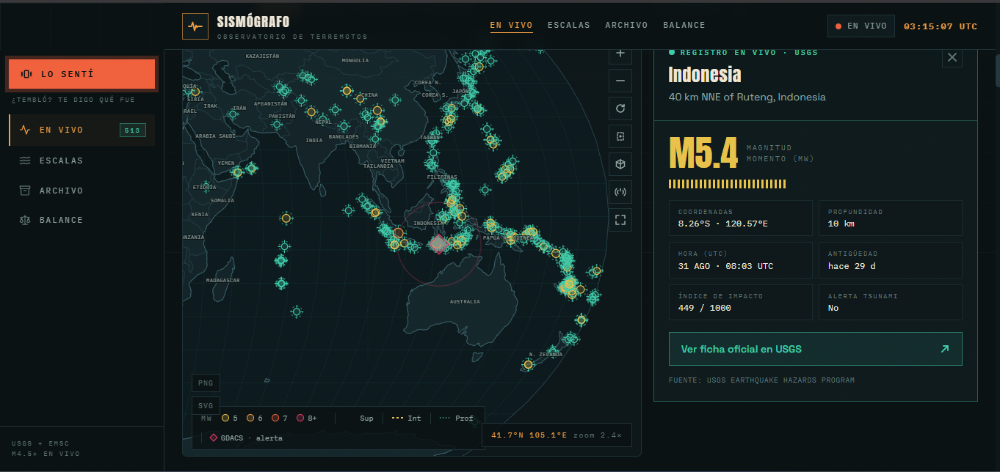
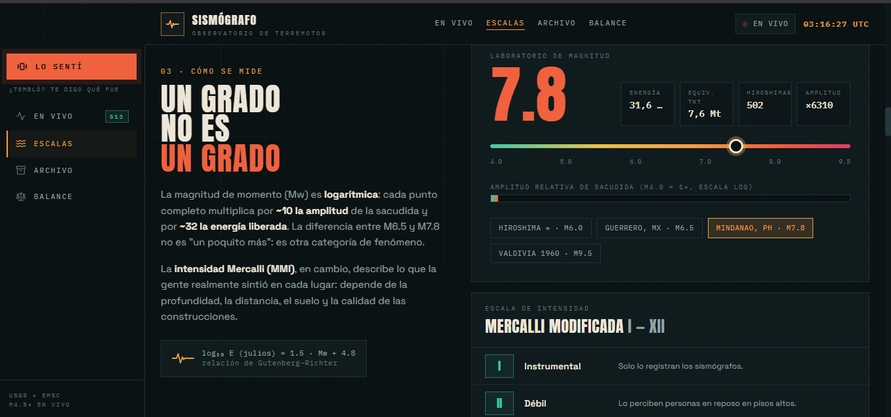

<div align="center">


# 📡 SISMÓGRAFO

**¿Sentiste un temblor?** Observatorio sísmico en vivo: te dice en segundos qué sismo fue, dónde y de qué magnitud, con datos del **USGS** y el **EMSC**. Mapa mundial de epicentros (proyección Natural Earth), archivo 2026 con bitácora y balance, laboratorio de magnitudes y botón **LO SENTÍ** con veredicto por geolocalización.

**PWA instalable · funciona sin conexión**

| En vivo | Escalas |
| --- | --- |
|  |  |
| Mapa USGS+EMSC, ficha del evento y botón LO SENTÍ | Un grado no es un grado: energía, Mercalli y simulador |

👨‍💻 **Desarrollado por [SysJoL](https://sysjol.onrender.com/)**

[](https://react.dev)
[](https://vite.dev)
[](https://www.typescriptlang.org)
[](https://tailwindcss.com)
[](https://pnpm.io)
[](https://developer.mozilla.org/es/docs/Web/Progressive_web_apps)
[](https://jhonylezama.github.io/sismografo-live-26/)

</div>

---

## ✨ Características

| | Vista | Descripción |
| --- | --- | --- |
| 🟢 | **En vivo** | Hero con veredicto del último sismo + botón **LO SENTÍ** (geolocalización → match por distancia y hora contra USGS/EMSC). Mapa live-only M≥4.5, lista única con ficha en bottom-sheet, señal con fuente elegible (USGS · EMSC · Ambas, deduplicadas), ventana 1 h · 24 h · 7 d · 30 d, refresco cada 5 min, caché offline y **alertas** M≥6 con sonido opcional. **Búsqueda por lugar** (tolera tildes) con chips de países calientes y `?q=` compartible. |
| 🧪 | **Escalas** | Un grado no es un grado: equivalencias de energía, escala Mercalli, onda simulada y sliders de magnitud/profundidad. |
| 📦 | **Archivo 2026** | Ficha del periodo, **mapa propio** del catálogo (capas Local/Ambos, `YearPlayer` mes a mes, filtros magnitud/región/mes/profundidad/zona) y **bitácora** ordenable con buscador y exportación CSV/GeoJSON. Tocar una fila ubica el evento en el mapa del archivo. |
| ⚖️ | **Balance** | Contadores del año: eventos M4+, víctimas, sismos M7+, coste estimado y países afectados. |
| 🚨 | **Capa GDACS** | Alertas sísmicas Red/Orange marcadas en el mapa con pulso y leyenda propia; snapshot refrescado a diario por el workflow de datos. |

- 🔗 **URL compartible**: `mag`, `region`, `month`, `modo` (local/both, archivo), `prof`, `zona` (área) y `q` (búsqueda) se codifican en la URL; las vistas son hash (`#en-vivo`, `#escalas`, `#registro`, `#balance`, `#acerca`).
- 📱 **Tipo app**: sidebar fija en desktop, bottom-tabs en móvil (En vivo · Escalas · LO SENTÍ · Archivo · Más) con una vista por pantalla y sheets para fichas, filtros y opciones.
- 📊 **PAGER + ShakeMap en la ficha**: detalle USGS con estimación de impacto (nivel, CDI, testigos, tsunami) e imagen de intensidad percibida.
- 📚 **Sugerencias de Wikipedia**: el workflow de datos propone enlaces a artículos; en la ficha puedes **Aceptar/Descartar** cada sugerencia (recuerdo persistido en `localStorage`).
- 🧾 **Fuentes citadas**: cada evento del catálogo enlaza sus fuentes oficiales (ficha USGS, informe GDACS) en el bloque **Fuentes citadas** de la ficha; las cifras curadas clave apuntan a su fuente primaria (p. ej. UNGRD en Colombia).
- 🚀 **Rendimiento**: código dividido con `React.lazy`, mapa memoizado y arrastre/zoom sin re-render por frame en móvil.
- 📱 **PWA**: instalable desde móvil y escritorio (banner inteligente + entrada en Más + shortcuts a En vivo/Archivo), fuentes en caché y shell offline.
- 🎨 Diseño oscuro "observatorio" con `Anton` / `Space Grotesk` / `IBM Plex Mono` y soporte de `prefers-reduced-motion`.

## 🗂️ Estructura del proyecto

```
src/
├── App.tsx                    # shell En vivo/Escalas/Archivo/Balance, filtros, URL+hash, alertas, capa GDACS
├── hooks.ts                   # useMediaQuery, usePrefersReducedMotion, useInstallPrompt
├── installSignals.ts          # señales de interés para el aviso PWA
├── main.tsx                   # registro del service worker (producción)
├── index.css                  # tema Tailwind v4 + animaciones
├── components/
│   ├── WorldMap.tsx           # mapa d3-geo: epicentros, placas, GDACS, selección, fullscreen
│   ├── SideNav.tsx            # barra lateral fija (desktop)
│   ├── BottomTabs.tsx         # barra inferior tipo app + sheet Más (móvil)
│   ├── FeltSheet.tsx          # veredicto LO SENTÍ (geolocalización + ranking)
│   ├── SearchBox.tsx          # búsqueda por lugar
│   ├── InstallBanner.tsx      # aviso de instalación PWA
│   ├── BottomSheet.tsx        # hoja inferior para móvil
│   └── …                      # SidePanel, Registry, Balance, MagnitudeLab, YearPlayer, Ticker…
└── data/
    ├── quakes.json            # catálogo 2026 (28 eventos, curado) + vínculos USGS
    ├── quakes.ts              # interfaz del catálogo y helpers
    ├── usgs.ts                # cliente del feed USGS (fetch + caché offline) + detalle PAGER
    ├── emsc.ts                # cliente del feed EMSC (seismicportal.eu) + dedupe al combinar
    ├── gdacs.ts               # cliente de la capa GDACS (snapshot público)
    ├── wikiSuggest.ts         # sugerencias de Wikipedia + flujo Aceptar/Descartar
    ├── export.ts              # CSV / GeoJSON / blobs
    └── plates.ts              # límites de placas tectónicas (PB2002)

scripts/
└── update-catalog.mjs         # sincronización diaria USGS/GDACS/Wikipedia + fuentes (--dry-run)

public/
├── manifest.webmanifest       # manifest PWA (rutas relativas → subpath, shortcuts)
├── sw.js                      # service worker (cache-first assets, fuentes y shell offline)
├── screenshots/               # capturas para el README (en-vivo.png, escalas.png)
├── gdacs.json                 # snapshot GDACS EQ (Red/Orange/Green) generado por el script
├── wikipedia-suggestions.json # enlaces propuestos por el script
└── icon-*.png                 # iconos generados por scripts/gen-icons.mjs
```

## 🔄 Flujo de datos

```
┌──────────────┐     ┌──────────────────┐      ┌──────────────────┐
│  USGS GeoJSON │ ──► │  usgs.ts (fetch) │ ──►  │  LiveQuake[]      │
│  M≥4.5 (1h…30d) │     │  + caché offline │      │  (mapa + alertas) │
└──────────────┘     └──────────────────┘      └──────────────────┘
      detalle (PAGER) ──► ficha del evento (nivel, CDI, testigos)

┌──────────────┐     ┌──────────────────┐      ┌──────────────────┐
│  quakes.json  │ ──► │  filtros + URL   │ ──►  │  mapa / bitácora  │
│  2026 (28)    │     │  (mag, región…)  │      │  / balance / año  │
└──────────────┘     └──────────────────┘      └──────────────────┘
      ▲                      ▲
      │ update-catalog.mjs (diario, vía GitHub Actions)
      │ USGS (backfill/vínculos) · GDACS (snapshot) · Wikipedia (sugerencias)
      │ — los campos curados nunca se sobrescriben —
┌──────────────┐     ┌──────────────────┐      ┌──────────────────┐
│  gdacs.json   │ ──► │  gdacs.ts (fetch)│ ──►  │  capa GDACS map   │
│ (Red/Orange/…) │     │  + caché         │      │  (Red/Orange)     │
└──────────────┘     └──────────────────┘      └──────────────────┘
┌──────────────────┐  ┌──────────────────┐  ┌──────────────────┐
│ wikipedia-       │──►│  wikiSuggest.ts  │──►│  ficha · banner   │
│ suggestions.json │  │  (Aceptar/…     │  │  (Aceptar/Descartar│
└──────────────────┘  └──────────────────┘  └──────────────────┘
```

## 🔄 Sincronización automática del catálogo

El workflow `.github/workflows/data-update.yml` corre cada día (00:03 UTC, con `workflow_dispatch` manual) y ejecuta `pnpm data:update`. Con `scripts/update-catalog.mjs`:

1. **USGS** — empareja cada evento con su ficha oficial (`usgsId`), actualiza solo los marcados como `needsReview`, detecta réplicas mal vinculadas y las repara, y propone **eventos nuevos** del feed *significant* (M6+).
2. **GDACS** — descarga el RSS de alertas sísmicas, escribe `public/gdacs.json` (solo si cambia) y lista las alertas Red/Orange nuevas.
3. **Wikipedia** — busca artículos en español para eventos sin enlace y añade sugerencias a `public/wikipedia-suggestions.json`.

Los campos **curados a mano** (fallecidos, heridos, coste, resumen, placas, tag) y los campos manuales **nunca se sobrescriben**: si el USGS difiere, la diferencia se *reporta* sin aplicarse. El resultado llega como **pull request** a `data/update-catalog` para que la revises y lo fusiones tú (flujo "solo sugiero, tú apruebas"). El reporte de cada corrida se escribe en `data-update-report.md` (ignorado por git).

## 📦 Datos

- **Catálogo local 2026**: 28 eventos de referencia en `src/data/quakes.json`, del **2 Ene al 14 Ago 2026** (22 vinculados a su ficha USGS). Es un catálogo **curado** (víctimas, coste, MMI, resumen) y el script de datos solo lo enriquece: nunca sobrescribe lo curado a mano. Lo que se actualiza día a día es el **feed en vivo del USGS** y los snapshots de **GDACS** y **Wikipedia**.
- **USGS Earthquake Hazards Program**: feed GeoJSON de sismos M≥4.5 (`4.5_1h`, `4.5_24h`, `4.5_7d`, `4.5_30d`) y detalle por evento (PAGER). Sin claves ni intermediarios. Dominio público.
- **EMSC (Centro Sismológico Euromediterráneo)**: API pública `seismicportal.eu` (FDSNWS, sin clave) como fuente alternativa/complementaria del feed en vivo, con ficha y enlace oficial al evento.
- **GDACS (JRC UE)**: RSS semanal de alertas por tipo de desastre; aquí se usan los sísmicos (`EQ`) para marcar en el mapa las alertas Red/Orange.
- **Wikipedia (es)**: la sincronización consulta la API pública (`action=query`) solo para *proponer* enlaces; la aceptación la haces tú en la ficha del evento.

## 🖥️ PWA e instalación

- **Manifest** + **service worker** con rutas relativas al scope, para servir correctamente bajo subpath (GitHub Pages). Shortcuts a En vivo y Archivo desde el icono instalado.
- Estrategia: cache-first para `assets/` (hasheados) y fuentes de Google, network-first para navegación con volcado a caché y fallback al shell offline.
- El **aviso de instalación** es inteligente: aparece al exportar el mapa, al seleccionar un sismo en el mapa o en visitas recurrentes (más rápido que la primera visita), con tope de 3 muestras por navegador. También hay entrada **Instalar app** en el sheet Más (con guía para iOS).

## 🛠️ Desarrollo

```bash
pnpm install
pnpm dev              # servidor de desarrollo (http://localhost:3000)
pnpm typecheck        # verificación de tipos
pnpm build            # compilación a dist/

pnpm data:update      # sincronización USGS/GDACS/Wikipedia (escribe snapshots)
pnpm data:update:dry  # simulación sin escribir archivos
node scripts/update-catalog.mjs --no-wiki --no-gdacs   # solo USGS
```

## 🚀 Despliegue (GitHub Pages)

El workflow `.github/workflows/deploy.yml` compila con pnpm y publica `dist/` en la rama `gh-pages` automáticamente al hacer push a `main` (o con `workflow_dispatch`). El workflow `.github/workflows/data-update.yml` actualiza el catálogo y los snapshots cada día y abre un PR para que revises los cambios.

1. En el repositorio, activa **Settings → Pages → Source: Deploy from a branch** → `gh-pages`, carpeta `/`.
2. El sitio queda disponible en `https://<usuario>.github.io/<repo>/`.

## 📄 Licencia

Uso educativo/académico. Los datos de sismos del USGS son de dominio público.
